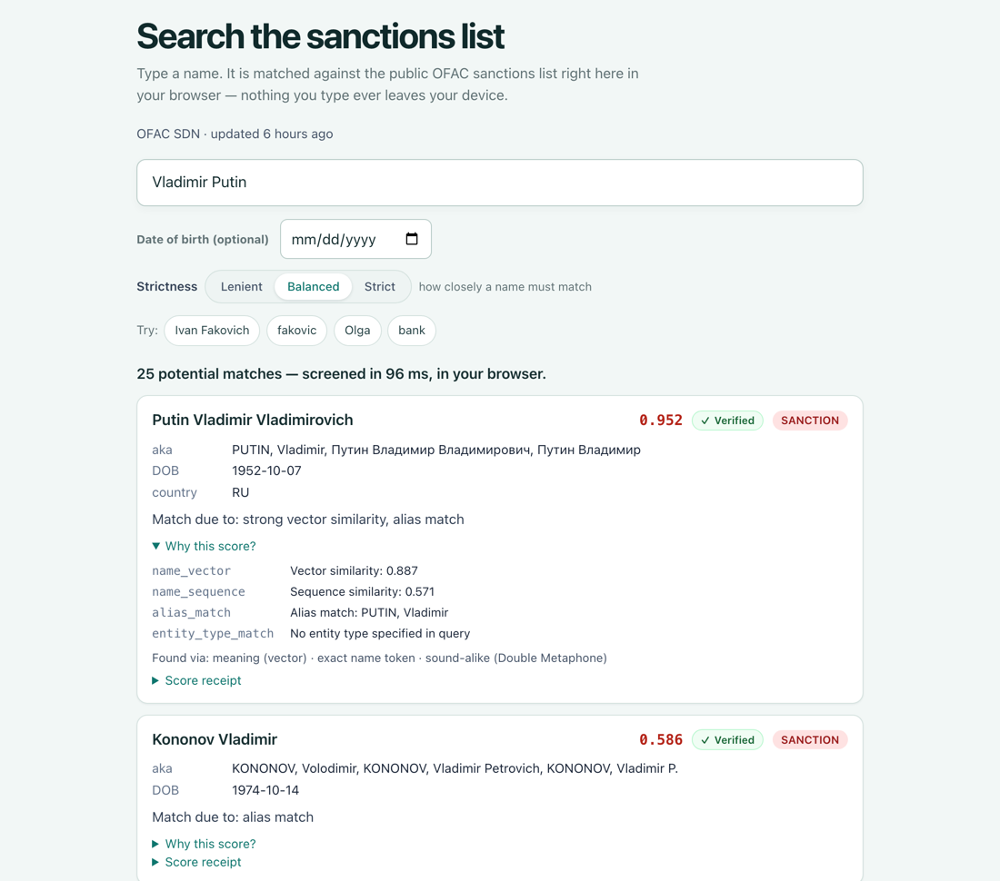
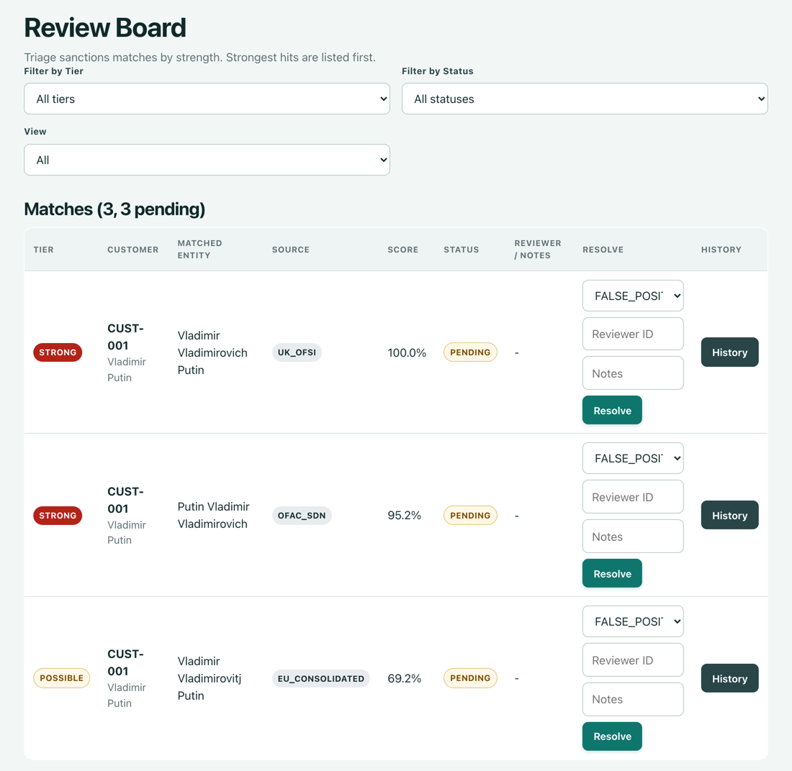

# AML-Filter

Free sanctions screening for small businesses: check a customer's name against government lists, in your browser.

**[Open the app at aml-filter.com](https://aml-filter.com)**. No sign-up, nothing to install.

If your business has to "know your customer", you have to check that the people you deal
with are not on a sanctions list. Big companies pay a screening vendor for this. Small
ones often search each government website by hand and keep notes in a spreadsheet. The
vendor costs money and gets a copy of your customer list. The manual way is slow, and a
name spelled a little differently is easy to miss.

AML-Filter is a free web page that does the checking for you. It searches the US, EU,
UN and UK sanctions lists, looks for names that are spelled or sound similar, and shows
why each result came up. It runs entirely in your browser. The names you type and your
customer list stay on your computer.

**Technical docs:** [Getting started for developers](docs/GETTING_STARTED.md) · [Architecture](docs/ARCHITECTURE.md) · [How matching works](docs/ARCHITECTURE.md#retrieval-and-scoring-in-one-paragraph) · [Watchlist format](docs/WATCHLIST_FORMAT.md) · [Deploy](docs/DEPLOY.md)

## Try it

1. Open [aml-filter.com/screen](https://aml-filter.com/screen). The first visit
   downloads the US sanctions list and a small name-matching model, about 70 MB. Later
   visits start fast.
2. Type `Vladimir Putin` and press Enter.
3. Click **Why this score?** under the top result.



The top result scores 0.952. Scores run from 0 to 1, and higher means a closer match.
The breakdown shows what drove it: the names are close in meaning and in spelling, and
"PUTIN, Vladimir" is one of the listed aliases. The results below it are weaker matches
that share a first name. The tool never decides for you. A person looks at each result.

The search page checks only the US list (OFAC). To check a customer against all four
lists and keep a record of your decisions:

4. Open **Customers**. The first time, it asks for your name, which is stamped on your
   decisions.
5. Add a customer with reference `CUST-001` and name `Vladimir Putin`, then click
   **Onboard**. It is screened right away. You can also import customers from a CSV or
   Excel file.
6. Open **Review**. Each possible match shows its list, score and strength (strong,
   possible or weak). Mark each one as a true match or a false positive and add a note.



## How it works

Every day a small program downloads the official lists from the US Treasury, the EU,
the UN and the UK government, puts them in one format, and signs them. When you open
the app, your browser downloads the signed lists from aml-filter.com and checks the
signature before using them. If the check fails, the app shows an error instead of
quietly showing no matches. Names are then matched inside the browser tab by meaning
(using a small language model that runs on your machine), by spelling, and by sound.
Your customers and decisions are saved in your browser's own storage, not on a server.

While the app is open, it checks for a newer list every 30 minutes. When a list
changes, it screens your saved customers again and only flags a match you already
reviewed if something about it changed.

## Which lists, and how fresh

| List | Published by | Entries (25 Sep 2026) |
| --- | --- | --- |
| OFAC SDN list | US Treasury | 19,391 |
| Consolidated list | European Union | 6,241 |
| Consolidated list | UN Security Council | 1,011 |
| UK Sanctions List (asset freezes only) | UK government (FCDO) | 5,682 |

The lists are rebuilt daily. The app shows when each list was last updated. If a source
could not be downloaded, the app says "Not updated for" and how long, rather than
pretending the list is current. You can switch lists on or off, and set how strict the
matching is, in **Settings**.

## What it does not do

- **It is not legal advice or a certified compliance product.** It helps you find
  possible matches. A qualified person must confirm each one against the official
  source and decide what to do. See [NOTICE](NOTICE).
- Sanctions lists only. It does not cover politically exposed persons (PEPs),
  news searches, or company ownership.
- One person, one browser. Customers and decisions live in the browser you used.
  There is no shared team view. Clearing your browser's site data deletes them. The
  spreadsheet export covers the customer table only, not your decisions.
- Needs the internet to open. There is no offline mode.
- Close misspellings, not wild ones. `Vladimir Poutine` still finds Putin, but as
  the second result. Read the whole list, not just the top line.
- Browsers: current desktop Chrome, Edge, Firefox and Safari 17 or later. Phones
  work in a lower-memory mode.

## When to use something else

| If you need | Use |
| --- | --- |
| Certified coverage, PEP and news data, and someone accountable | A commercial screening vendor |
| A few one-off checks | The official search pages, such as [OFAC's Sanctions List Search](https://sanctionssearch.ofac.treas.gov/) |
| One shared review queue for a whole team | A screening server you host |
| Private checks across four lists with the reasons shown, and nothing to run | AML-Filter |

## Run it yourself

You need [Node 22.13](frontend/.nvmrc) and pnpm (which `corepack` provides).

```bash
git clone https://github.com/hseshadr/aml-filter
cd aml-filter/frontend
corepack enable
pnpm install
pnpm --filter aml-filter-app dev
```

Open http://localhost:5173/screen. Use `localhost`, not a network address, because the
browser only allows the signature check there. The first run takes a few minutes while
it downloads the name-matching model.

Your local copy searches a small made-up list of 8 people that ships with the code, so
it works on a fresh clone. Type `fakovic` and it finds "Ivan Fakovich". For the real
lists, use [aml-filter.com](https://aml-filter.com). To host your own copy with real
lists, see [Deploy](docs/DEPLOY.md).

## Develop

New to the code? Start with [Getting started for developers](docs/GETTING_STARTED.md).
It takes you from a fresh clone to a passing local build and your first change.

```bash
cd frontend && pnpm gate
```

This runs the same checks as CI: lint, type checks, unit tests, builds, match-quality
checks, and real-browser tests. It needs the exact Node version in
[`frontend/.nvmrc`](frontend/.nvmrc).

## More detail

- [Getting started for developers](docs/GETTING_STARTED.md): set up, run the checks, make a first change.
- [Quickstart](docs/QUICKSTART.md): a longer walkthrough of every page, for users.
- [Architecture](docs/ARCHITECTURE.md): the packages, how matching and scoring work, the
  security summary, and what the tests prove.
- [Explore the interactive architecture map](docs/architecture/index.html).
- [Watchlist format](docs/WATCHLIST_FORMAT.md): how the lists are signed and packaged.
- [Match quality](docs/RECALL.md): how often the right name is found, measured on the real US list.
- [Memory and browser support](docs/MEMORY-ARCHITECTURE.md): how the app stays inside a phone's memory.
- [Deploy](docs/DEPLOY.md): build settings and hosting your own copy.
- [Operations](docs/OPERATIONS.md): publishing lists and handling incidents.
- [Security](SECURITY.md): how to report a vulnerability.
- [Contributing](CONTRIBUTING.md): how we work and what a PR needs.
- [Changelog](CHANGELOG.md): what changed in each release.

## License

MIT. See [LICENSE](LICENSE). Data attribution for the sanctions lists is in
[NOTICE](NOTICE).
