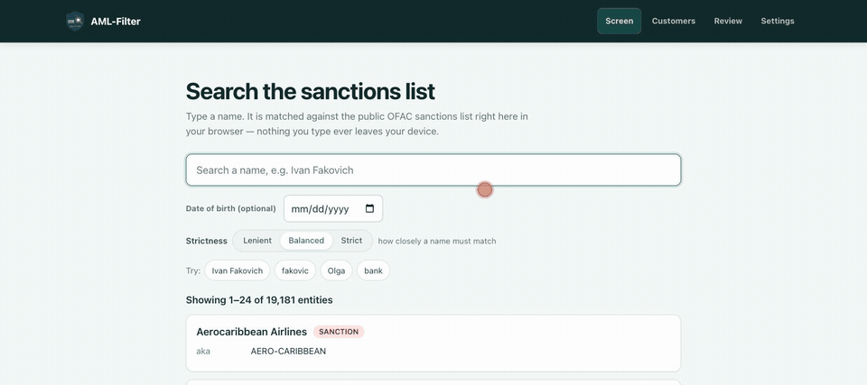

# AML-Filter

Screens a name against the OFAC SDN, EU, UN and UK OFSI sanctions lists — entirely inside your browser tab. No server, no signup, and nothing you type is uploaded.



**[Try it at aml-filter.com](https://aml-filter.com)** — nothing to install. Or run the whole thing locally:

```bash
git clone https://github.com/hseshadr/aml-filter && cd aml-filter/frontend && corepack enable && pnpm install && pnpm --filter aml-filter-app dev
```

The recording starts from a warm tab. A first visit downloads the sanctions list (zstd-compressed in transit) and a 23 MB embedding model before it can screen anything; the boot banner reports the real byte count as it goes. Both are then cached, so a repeat visit starts fast. **You still need a network connection to open the page** — there is no service worker, so this is not an offline app. The live demo loads OFAC SDN on a cold visit — 19,181 entities, the population [`buildRealBundle.ts`](frontend/packages/amlfilter-publisher/src/buildRealBundle.ts) cross-validates against Treasury's own `SDN_ADVANCED.XML`. The EU, UN and UK OFSI lists are opt-in under Settings, which shows each list's real entity count. Screening time is measured in your own browser and printed with every result, which is the only honest place for that number.

---

[](https://github.com/hseshadr/aml-filter/actions/workflows/ci.yml)
[](https://aml-filter.com)
[](LICENSE)
[](https://www.typescriptlang.org/)
[](frontend/.nvmrc)

**A free, zero-server watchlist-filtering and KYC-review app that runs entirely in your browser — screens your customers against multiple sanctions lists, shows exactly why each one matched, and gives reviewers an auditable workflow.**

> **Live at [`aml-filter.com`](https://aml-filter.com)** — hosted on Cloudflare Pages, screening entirely in your browser (the signed watchlist bundle is served same-origin). The source is public and MIT-licensed: clone it and the whole thing runs locally with no backend, no key, and no account. [`docs/DEPLOY.md`](docs/DEPLOY.md) covers self-hosting.

## Status

Three things answer "is it working?", and none of them can go stale:

- **The CI badge above** is the latest run on `main`. Every per-commit CI and deploy run
  is in the [Actions tab](https://github.com/hseshadr/aml-filter/actions).
- **[`aml-filter.com/build.json`](https://aml-filter.com/build.json)** is the exact commit
  the live site is serving right now.
- **`pnpm gate`** reproduces the whole thing locally on [Node 22.13](frontend/.nvmrc) —
  typecheck, lint, unit tests, build, i18n, KYC, and the real-Chromium Playwright lanes:

```bash
cd frontend && pnpm gate
curl -fsSL https://aml-filter.com/build.json
```

This section used to be a hand-written snapshot: a pinned SHA labelled "current `main`",
exact test counts, and a paragraph of verified behaviours. On the day it was removed that
SHA was 37 commits and 11 days behind `main`, and the boot behaviour it described had
since been changed by [#92](https://github.com/hseshadr/aml-filter/pull/92) and
[#94](https://github.com/hseshadr/aml-filter/pull/94). A status block maintained by hand
rots by construction, so it is gone rather than refreshed — the badge, `build.json`, and
`pnpm gate` answer the same questions from sources that update themselves.

For the mobile-memory design (serialized boot, one resident list, explicit
build → swap → dispose) see [`docs/MEMORY-ARCHITECTURE.md`](docs/MEMORY-ARCHITECTURE.md).
Playwright WebKit is a local/macOS profile that skips when its emulator lacks
OPFS/SQLite; a physical iPhone fresh-tab check is an owner-gated acceptance step, not
part of CI. The app is a reference implementation, not legal or regulatory advice, and
embedded WebViews are outside the release contract.

## Browser support

The supported production baseline is the current and previous desktop releases of
Chrome, Edge, Firefox, and Safari 17+. The browser must expose module Workers, OPFS,
WebCrypto, and Web Locks in a secure context. The app detects these before boot and
shows an explicit unsupported-browser screen. Mobile Safari and Chrome use bounded
one-list-at-a-time vector residency so the workstation does not overlap every watchlist
with the ONNX/WASM model. Desktop browsers use the same bounded mode when memory is
unknown or ≤8 GB; eager residency is reserved for an explicitly reported >8 GB desktop.
Embedded WebViews are not part of the release contract.

## TL;DR

- **What it is** — a sanctions-screening + KYC-review workstation that runs 100% in the
  browser tab: fuzzy name-matching against OFAC/EU/UN/UK watchlists, explained scores,
  and an auditable review workflow. No server-side database to provision; private KYC
  state is persisted locally in SQLite-WASM on OPFS.
- **Why it works** — the heavy lifting is precomputed and signed at publish time (name
  vectors, content-addressed chunks); the tab only verifies (Ed25519, fail-closed),
  embeds one query with an in-tab MiniLM, and runs a transparent 5-signal scorer.
  Customer data lives in SQLite-WASM on OPFS and never leaves the machine.
- **Worked example** — `cd frontend && pnpm install && pnpm --filter aml-filter-app dev`,
  open `/screen`, type a sanctioned name: you get a ranked match card with the per-signal
  score breakdown ("strong name-vector similarity, country match") naming its source
  list. Load customers at `/customers`, work the matches at `/review`.
- **Core invariants** — verify-before-parse on every byte (any signature/hash mismatch
  aborts — fetched and cached alike); customer data never leaves the browser; reviews are
  append-only during a customer's lifecycle (`match_events`, enforced by SQLite triggers
  rather than by convention — [what that does and does not
  mean](#what-append-only-means-here)) and only re-open when the
  match **materially** changes; deleting a customer atomically removes that ledger from
  the application database too;
  the TS scorer is parity-locked by frozen golden fixtures; `pnpm gate` == CI, literally.

Banks and businesses are legally required to check that the people they deal with
aren't on government sanctions lists. The hard part isn't looking a name up — it's
deciding when two *differently-spelled* names are the same person. The same person
shows up as "Robert", "Bob", and "Rob"; names get spelled a dozen ways across
alphabets; one typo can hide a real match.

**aml-filter does that fuzzy name-matching, shows its work, and does all of it in a
browser tab — no server-side database, no signup, and no remote screening API.** Open
the app and it:

1. **Downloads a signed catalog of watchlists** — OFAC SDN plus EU, UN, and UK/OFSI —
   and verifies every one *in the tab* (Ed25519, fail-closed — any bad signature or hash
   aborts the load). You choose which lists are active in **Settings**.
2. **Holds your customers locally** — your *whitelist* lives in SQLite-WASM on OPFS,
   inside your own browser. Customer data never leaves your machine. The Customers
   workspace can import CSV/XLS/XLSX files through a preview-first, duplicate-safe
   flow and export a tabular XLSX snapshot locally.
3. **Screens every customer across all enabled lists entirely in the browser**, scoring
   each candidate and handing back a number *plus a plain-English reason* — "strong
   name-vector similarity, country match" — tagged with which list it came from. No
   black box; a reviewer can always see why.
4. **Gives reviewers an auditable workflow.** Each match is reviewed once; a re-screen
   only re-flags it (**CHANGED — needs re-review**) when the underlying data materially
   changes. Every disposition is appended to an audit trail you can open per match;
   deleting the customer removes its matches and audit history in the same transaction.
   SQLite `secure_delete=ON` overwrites deleted cells, and the persistent database uses
   rollback-journal `DELETE` mode instead of a reusable WAL. Browser/OS storage may still
   retain forensic remnants or backups outside the app's control; clearing site data is
   the authoritative device-level reset. Sensitivity
   (Strict / Balanced / Lenient) and per-list thresholds are
   configurable.
5. **Keeps both sides in sync.** A new list version re-screens all your customers;
   editing a customer re-screens that one customer.

Lean and mean: the whole thing is TypeScript that runs client-side. The lists are just
signed static files served from any host or CDN, cached durably in your browser so a
repeat visit does not re-download them — and re-verified fail-closed on every load.

> _aml-filter is an engineering-portfolio demo, **not** a compliance product. Do not
> use it to meet any legal or regulatory obligation. See the
> [Disclaimer](#disclaimer) and [`NOTICE`](NOTICE)._

## Quickstart — clone to screening in ~10 minutes

You need [Node 22.13](frontend/.nvmrc), [pnpm](https://pnpm.io/), and internet access on
the first run (it downloads the ~23 MB embedding model once, so the browser never pulls a
model from a CDN afterwards). Nothing else — no backend, no database, no API key, no
account. Everything runs from the `frontend/` directory (the pnpm workspace is rooted
there — there is no root `package.json`).

```bash
git clone https://github.com/hseshadr/aml-filter
cd aml-filter/frontend

corepack enable                    # provides the pinned pnpm version
pnpm install
pnpm --filter aml-filter-app dev   # stages the model weights, then starts Vite
                                   # (prints a localhost URL, default http://localhost:5173)
```

The first `dev` run stages the MiniLM weights, the onnxruntime WASM runtime, and the
landing page's measured stats before Vite starts — a couple of minutes once, ~1 second
on every run after.

Open the printed URL, then:

- **`/screen`** — the in-tab screening demo. Type a name and watch it match as you type,
  across every enabled list, with a scored, explained match card that names its source
  list. (A made-up name returns nothing; a name on a watchlist returns a ranked,
  reason-by-reason result.)
- **`/customers`** — load your own customers (the local whitelist) and let the app
  auto-screen them against all enabled lists.
- **`/review`** — work the resulting matches: tiered, filterable (All / Needs review /
  Changed only), with a per-match History drawer. Resolve each one with a reviewer note.
- **`/settings`** — choose which lists are active, set sensitivity and per-list
  thresholds, name the analyst, and clear the durable list cache.

On `/customers`, **Import CSV/XLS/XLSX** opens a local preview. Files are parsed in a
short-lived worker, capped at 10 MB and 5,000 rows, validated for required identity
fields, and checked for duplicate references before accepted rows are committed in one
SQLite transaction and re-screened. **Export XLSX** downloads the customer table
locally with spreadsheet-formula-looking text escaped. This is a tabular customer
transfer, not a full backup of matches, audit events, settings, or the watchlist cache.

The demo catalog (four small fictional lists) is already built, signed, and committed, so
`/screen` works on a cold clone with no extra steps. It is signed with a throwaway demo
key that is deliberately **not** the production trust root, so a local `dev` / `preview`
server serves that demo verify key at `/public.key`, and prints one line saying so when it
starts. The deployed site pairs the production bundle with the production pin — see
[`docs/QUICKSTART.md`](docs/QUICKSTART.md).

### Production build & preview

```bash
cd frontend
pnpm --filter aml-filter-app build     # tsc --noEmit && vite build
                                       #   (a prebuild hook stages the MiniLM model
                                       #    weights, WASM runtime, and demo stats)
pnpm --filter aml-filter-app preview   # serves the minified production build locally
```

> **Config (optional):** the app reads build-time settings from `frontend/app/.env`
> (Vite vars). Copy [`frontend/app/.env.example`](frontend/app/.env.example) to
> `frontend/app/.env` to point at a hosted bundle (`VITE_BUNDLE_BASE_URL`) or tune the
> model-load ceiling (`VITE_MODEL_LOAD_TIMEOUT_MS`). None are required for the local demo.

### Run the checks (the gate)

One command from `frontend/` — CI runs this exact script, so local and CI can't drift:

```bash
cd frontend
pnpm gate
# = pnpm -r lint        Biome (lint + format)
#   pnpm -r typecheck   tsc strict, every workspace member
#   pnpm -r test        Vitest (incl. scoring + tiering parity goldens)
#   pnpm -r build       production build across the workspace
#   + the three Playwright e2e lanes (real Chromium, minified build):
#     test:e2e:c1       in-tab screening against the committed signed watchlist
#     test:e2e:kyc      backend-free KYC journey (onboard → auto-screen → review → resolve)
#     test:e2e:bundle   signed-bundle delta-sync boot (verify → OPFS → offline reload)
```

## Under the hood — the three TypeScript units

There is no backend. The product is three TypeScript packages plus a React SPA, all
under `frontend/`.

### 1. Publisher — `@amlfilter/publisher`

[`frontend/packages/amlfilter-publisher`](frontend/packages/amlfilter-publisher) is the
build-time tool that produces the signed lists. Each watchlist source is a
**`WatchlistSource` adapter** (`src/sources/`) that knows how to `fetchRaw()` and
`parse()` one list into a neutral entity shape; the publisher then normalizes →
embeds names with **transformers.js in Node** (no torch, no Python) → Ed25519-signs.
It registers every list in a `catalog.json` and packs the whole set — the catalog plus
each list's entities and precomputed name vectors — into a **signed, content-addressed
bundle**: a signed `latest` pointer → a content-hashed `manifest` → deduplicated
`chunk/` files the browser delta-syncs and verifies fail-closed.
Entity IDs are namespaced per list (`OFAC_SDN:…`, `EU_CONSOLIDATED:…`). The wire format
is documented in [`docs/WATCHLIST_FORMAT.md`](docs/WATCHLIST_FORMAT.md).

Four live adapters ship: **OFAC SDN**, **UN**, **EU**, and **UK/OFSI**. Each must fetch
successfully, produce a source-specific plausible entity count, and prove an upstream
update time within 90 days. A missing, empty, truncated, stale or future-dated feed is
rejected — that data is never signed into a bundle.

**Each list is refreshed on its own.** These are four independent third parties and they
go down separately. When one is unreachable that list is re-served from the copy already
published — fetched back through the full trust chain, keeping its own older version,
stamped with the age it actually has — while the others refresh normally. Before this,
one 500 from the EU webgate also blocked the OFAC refresh, which is the list most people
screen against.

A re-served list is never presented as current: `catalog.json` and each
`<slug>/meta.json` carry that list's own `fetchedAt`, `sourceUpdatedAt` and `stale` flag,
and the app shows the age beside every list you can enable. A list that can be neither
refreshed nor verified from the published bundle aborts the publish outright — a bundle
never claims coverage it does not have.

Every external feed request is abortable after 45 seconds, so an unresponsive upstream
cannot hold a CI runner indefinitely.

```bash
# from frontend/
pnpm --filter @amlfilter/publisher run build-demo-bundle    # rebuilds the committed signed demo bundle the app loads
pnpm publish-list                                           # the production single-list publish CLI (alias for @amlfilter/publisher publish)
```

The production publish CLI takes flags:

```
--in <entities.jsonl>  --version <v>  --key <raw-32-byte-ed25519-seed-file>  --out <dir>  [--models <dir>]
```

In CI, [`.github/workflows/publish-watchlist.yml`](.github/workflows/publish-watchlist.yml)
attempts a refresh daily (cron `0 6 * * *`) and on manual dispatch: it fetches the four
live lists, builds `entities.jsonl`, signs with the `WATCHLIST_SIGNING_KEY` repo secret
(a base64-encoded raw 32-byte Ed25519 seed), and emits the signed static files.

**Daily is the schedule, not a promise.** Upstream feeds go down, and when one does its
list keeps the age it has until that feed comes back. So the honest claim is: *each list
is refreshed daily when its source is reachable, and every list shows you its own last
successful update time.* Do not read a daily cron as a guarantee that every list is under
24 hours old — read the age the app shows you.

That claim is enforced rather than asserted:
[`.github/workflows/watchlist-freshness.yml`](.github/workflows/watchlist-freshness.yml)
checks the **live** published bundle several times a day, verifies the pointer signature,
and opens an issue if any list has gone stale. It exists because the publish cron once
failed for 22 consecutive days without anyone noticing.

### 2. Browser engine — `@amlfilter/browser`

[`frontend/packages/amlfilter-browser`](frontend/packages/amlfilter-browser) is the
in-tab screening engine. It syncs the signed bundle same-origin — the signed `latest`
pointer → the content-hashed `manifest` → only the missing `chunk/` files — and verifies
every byte **fail-closed** (Ed25519 + SHA-256 against the pinned public key
[`frontend/app/public/public.key`](frontend/app/public/public.key); any signature or
hash mismatch aborts) → materializes the catalog and each enabled list → decodes the
precomputed name vectors → embeds the query or customer name in-tab
(transformers.js MiniLM, `Xenova/all-MiniLM-L6-v2`, 384-dim) → runs a brute-force cosine
search → scores each candidate with an explainable weighted scorer.

The `MultiListScreeningEngine` (`engine/multiEngine.ts`) uses one shared embedder and
supports two residency modes. Eager mode holds one vector index per enabled list; the
bounded streaming mode keeps metadata for every enabled list but loads, screens, and
disposes one vector index at a time (with a one-list cache and serialized queries). In
either mode it embeds the query once, applies each threshold
(`perList[id] ?? query.threshold ?? default`), then merges and re-ranks — a strong hit
in *any* list surfaces. The workstation's deterministic browser memory policy selects
streaming on iPhone/iPad/Android, on devices reporting ≤8 GB, and whenever the browser
cannot report a memory budget; eager residency is reserved for an explicitly reported
>8 GB desktop. The persisted list selection and per-list thresholds are unchanged.

The scorer (`computeScore` / `PRESETS`: `strict` / `balanced` / `lenient`) sums five
signals — `name_vector`, `name_trigram`, `alias_match`, `dob_match`, `country_match` —
and every match carries the per-signal breakdown plus a plain-language summary.

Every scored match is also **sealed in the engine at the moment it is produced**: a
per-install Ed25519 key signs the score, tier, engine and watchlist versions, and an
inputs hash (`engine/matchReceipts.ts`, `engine/installKey.ts`,
`engine/scoreReceipt.ts`), yielding the signed score receipt the UI verifies — see
[Trust model](#trust-model).

Verified bundle bytes are cached durably in the **OPFS bundle store** (owned by the sync
Web Worker, separate from the customer DB) and re-verified fail-closed on every load, so a
repeat visit screens without re-fetching the list. If the pointer fetch fails, the sync
falls back to the cached active version — but the page itself still has to load over the
network first, so this is list caching, not an offline mode.

Entry point: `EngineRuntime.bootstrap()` → `ScreeningEngine.screen({ name })`.

### 3. Workstation app — `@amlfilter/workstation` + the React SPA

[`frontend/packages/amlfilter-workstation`](frontend/packages/amlfilter-workstation) is
the local-first KYC tier, and [`frontend/app`](frontend/app) is the React SPA on top of
it. A SQLite-WASM/OPFS DB Web Worker holds your customers and match history (schema v4:
`customers`, `kyc_matches` — now with `material_fingerprint` + `review_state` columns —
the append-only `match_events` audit trail, and `settings`). The package owns
onboarding, review, tiering, and the **bidirectional rescan** (`rescan.ts`:
`screenCustomer`, `rescanAll`, `syncWatchlist`).

**Review once, re-review on material change.** Each match stores a `material_fingerprint`
(`fingerprint.ts`) hashed over the customer's identity fields and the matched entity's
identity fields. On a rescan, an unchanged match keeps its prior disposition and stays
suppressed; a materially-changed one is flagged **CHANGED** (keeping the prior
disposition) and an event is appended. `match_events` is insert-only — `DETECTED`,
`DISPOSITIONED`, `REOPENED`, `CHANGED`, `SUPPRESSED` — and is the audit trail the History
drawer reads.

<h4 id="what-append-only-means-here">What "append-only" means here</h4>

Two SQLite triggers (schema v4) enforce it in the database, so this is a property of the
storage engine rather than a habit of the code that happens to write to it:

| Operation on `match_events` | Result |
| --- | --- |
| `UPDATE` — any column, any row | **Refused.** No lifecycle path has ever needed one. |
| `DELETE` while the customer still exists | **Refused.** A single event cannot be lifted out of a live trail, and the ledger cannot be truncated. |
| `INSERT OR REPLACE` over an existing `event_id` | **Refused.** (`recursive_triggers` is on and verified at open — without it, `REPLACE` skips the delete trigger and swaps a forged row in silently.) |
| `INSERT` of a new event | Allowed. Corrections are appended; the superseded decision stays readable. |
| `DELETE` after the customer row is gone | Allowed — this is the erasure path. `deleteCustomer` removes the customer first, then the trail, in one transaction. |

**And what it does not mean.** This is not tamper-evidence, and we are not going to
pretend otherwise: the database is a file on your machine and you hold every key to it.
Anyone who can open that OPFS file with their own SQLite can drop the triggers and
rewrite whatever they like. There is no hash chain and no signature over the ledger, so
such an edit leaves no trace for anyone to find later. What the triggers buy is real but
bounded — **the application cannot rewrite its own audit history**, by accident, by a
future code path, or through the devtools console — and that is a different and much
weaker claim than "this log can be proven intact to a regulator". Anyone who needs the
stronger property needs to export events to storage the reviewer does not control.

React routes:

- `/` — marketing landing
- `/screen` — the in-tab screening demo (across enabled lists)
- `/customers` — your local customer whitelist (auto-screened)
- `/review` — the review board: tiered, View filter (All / Needs review / Changed only),
  Source column, per-match History drawer
- `/settings` — sensitivity + per-list thresholds, list selection, analyst name, clear cache

No login, no API key.

Full write-up and diagrams: [`docs/ARCHITECTURE.md`](docs/ARCHITECTURE.md),
[`docs/diagrams/`](docs/diagrams/).

## Trust model

The lists are distributed as plain **signed static files** on any host or CDN — no
application server in the path. In the browser:

- The engine fetches the signed **`latest` pointer** — the bundle's trust anchor — and
  verifies its detached Ed25519 signature first. Its signed, repository-wide monotonic
  `sequence` prevents a valid older pointer from rolling back an active bundle.
- It then fetches the content-addressed **`manifest`** and each **`chunk`** the manifest
  names, verifying every byte (Ed25519 + SHA-256) before materializing the catalog and
  lists.
- **Verification is fail-closed against the pinned
  [`public.key`](frontend/app/public/public.key)** baked into the app build (one trust
  anchor for the whole bundle — verify-before-parse, top to bottom). Any signature or hash
  mismatch aborts the load — there is no silent fallback to unverified bytes. The same
  fail-closed check runs over bytes served from the durable OPFS cache, so a poisoned
  cache entry can never be trusted.

The signing private key never leaves CI: it lives only as the `WATCHLIST_SIGNING_KEY`
GitHub Actions secret used by the publish workflow.

### Signed score receipts

The same discipline extends from the engine's input to its output. Every scored match
on `/screen` carries a **signed score receipt**: the engine seals
`{score, tier, engine version, watchlist version, inputs hash}` with an Ed25519 key
generated for this browser install, using the `@edgeproc/avow` receipt format
(RFC-8785 canonical JSON + Ed25519). What you see is a small status chip beside each
match score — **Verified** (✓) in the normal case, **Not verified** when a check fails
(✕ tampered or invalid signature, ⚠ untrusted signer), plus explicit pending and
unavailable states while the trust key loads or when browser storage is blocked. A
receipt-bearing match never renders without a chip, and expanding **Score receipt** on a
match card shows the full signed envelope (algorithm, signer key, payload hash,
signature, and the sealed subject). The verdict is computed in your browser against this
install's own key, with no server asked — alter the sealed data in any way and the chip flips to
"Not verified — tampered" (the e2e suite proves exactly that: tampering one byte flips
the verdict).

One honest caveat, in the same breath: the signing key lives in ordinary browser
storage, so a receipt is **tamper-evident provenance** — this exact score was produced
and not altered afterwards — **not** proof the machine was uncompromised at signing
time, and not a hardware-backed key. Full design:
[`docs/ARCHITECTURE.md`](docs/ARCHITECTURE.md#score-receipts).

## Correctness & parity

Scoring and tiering correctness are locked by committed **golden JSON** parity tests:

- [`frontend/packages/amlfilter-browser/src/engine/__fixtures__/scoring/golden.json`](frontend/packages/amlfilter-browser/src/engine/__fixtures__/scoring/golden.json)
- [`frontend/packages/amlfilter-workstation/src/__fixtures__/tiering/golden.json`](frontend/packages/amlfilter-workstation/src/__fixtures__/tiering/golden.json)

These are now **frozen regression snapshots**: the TypeScript implementation is the
source of truth. (The generators that once produced these goldens were removed in the
pivot to a pure-TypeScript app.) Any drift in score, reasons, or tier classification
fails the test suite.

## The sanctions lists (data)

aml-filter never bundles or redistributes any official sanctions list as part of the
app. The signed lists are built from public sources via per-list adapters — the U.S.
Treasury OFAC **SDN List**, the EU Consolidated list, the UN Consolidated list, and the
UK/OFSI consolidated list, all government works in the public domain.

The SDN **records** are read from the U.S. Commerce Department's **Consolidated
Screening List** (<https://data.trade.gov>), keeping only the rows OFAC designates —
Treasury's own export moved behind a bot-challenge WAF in July 2026 and can no longer be
read by a build. That feed publishes names in Latin script only, so each record's
**non-Latin aliases** (Cyrillic, Arabic, CJK) are added from Treasury's own published
`SDN_ADVANCED.XML`, obtained through a public mirror and joined on the OFAC entity
number. Two sources with two different trust properties — both are named in
[`NOTICE`](NOTICE), and a deploy that cannot reach the mirror reports reduced alias
coverage rather than implying it has the full set.

The committed demo catalog is built from small sets of **fictional** entities so the
demo is turnkey from a cold clone. Always screen against the current official lists;
they change often. Attribution and the full data note are in [`NOTICE`](NOTICE).

## Docs

This README is the canonical index.

- [`docs/QUICKSTART.md`](docs/QUICKSTART.md) — clone → run → screen a name.
- [`docs/ARCHITECTURE.md`](docs/ARCHITECTURE.md) — the in-browser pipeline, the three
  units, the scoring contract.
- [`docs/WATCHLIST_FORMAT.md`](docs/WATCHLIST_FORMAT.md) — the signed catalog + per-list
  wire format.
- [`docs/DEPLOY.md`](docs/DEPLOY.md) — publishing and hosting the signed catalog + list files.
- [`docs/OPERATIONS.md`](docs/OPERATIONS.md) — threat/privacy data flow, numeric SLA and
  performance budgets, recovery behavior, and exact-deployment proof.
- [`docs/MEMORY-ARCHITECTURE.md`](docs/MEMORY-ARCHITECTURE.md) — resident-memory
  inventory, bounded residency policy, and the SQLite-vector adoption gates.
- [`docs/diagrams/`](docs/diagrams/) — d2 sources + rendered SVGs.

## Repo layout

```
aml-filter/
├── frontend/                            # pnpm workspace (Node 22.13, pnpm, Biome, Vitest, Playwright)
│   ├── .nvmrc                           #   pinned Node version
│   ├── app/                             #   React + Vite SPA — landing · /screen · /customers · /review · /settings
│   │   ├── public/public.key            #   pinned Ed25519 verify key
│   │   └── public/bundle/origin/        #   committed signed content-addressed demo bundle: latest + manifest/ + chunk/
│   └── packages/
│       ├── amlfilter-publisher/         #   @amlfilter/publisher — list adapters → embed → sign → signed content-addressed bundle
│       ├── amlfilter-browser/           #   @amlfilter/browser — bundle delta-sync + verify + embed + cosine search + scorer + OPFS cache
│       └── amlfilter-workstation/       #   @amlfilter/workstation — SQLite-WASM/OPFS DB worker + rescan + audit trail
├── .github/workflows/publish-watchlist.yml  # daily signed-list publish
├── docs/                                # ARCHITECTURE · QUICKSTART · DEPLOY · WATCHLIST_FORMAT · diagrams/
├── LICENSE  NOTICE  CHANGELOG.md  CONTRIBUTING.md
```

## Disclaimer

aml-filter is a software demonstration and engineering-portfolio project. It is a
**reference implementation, NOT legal advice, NOT a regulatory-compliance product, and
NOT a substitute for a qualified compliance program or a commercial sanctions-screening
vendor.** Sanctions screening has real legal consequences; any match — or absence of a
match — must be reviewed by qualified compliance personnel against the official OFAC
source before any decision is made. The operator is solely responsible for their own
regulatory obligations and for any actual filings. The software is provided "as is",
without warranty. See [`NOTICE`](NOTICE) and [`LICENSE`](LICENSE).

## License

[MIT](LICENSE). Built on the signed-bundle / local-compute concepts from
[edge-proc](https://github.com/hseshadr/edge-proc). Third-party data attribution is in
[`NOTICE`](NOTICE).
