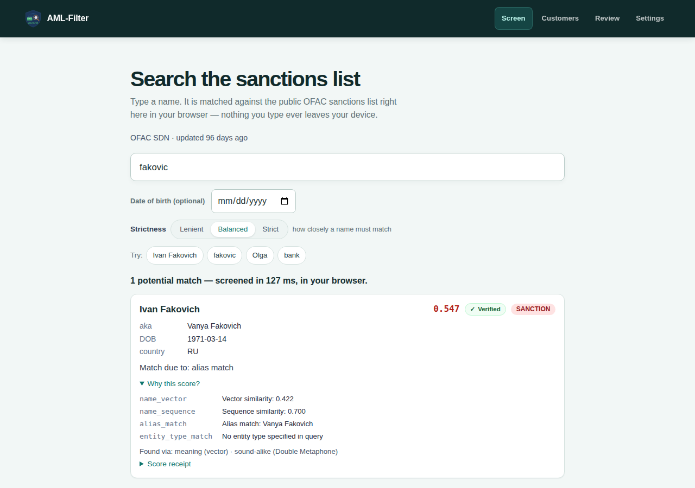
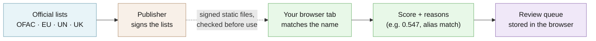

# AML-Filter

Checks your customers' names against government sanctions lists inside your browser, for small compliance teams.

[](https://github.com/hseshadr/aml-filter/actions/workflows/dagger.yml)
[](CHANGELOG.md)
[](LICENSE)

**[Live demo](https://aml-filter.com)** · [Docs](docs/ARCHITECTURE.md) · [Quickstart](docs/QUICKSTART.md)


<sub>Real output of the example below — the Screen page of the local production build at http://localhost:4173, searching the fictional demo list that ships with the repo (screening time varies by machine).</sub>

## At a glance

- **What it does** — Like the name-screening tools banks pay a vendor for, but it runs in your own browser tab. Type a name (misspellings are fine) and it checks it against the U.S. (OFAC), EU, UN, and UK (asset-freeze) sanctions lists, then shows a score and the reasons behind it — not just "match" or "no match". It also keeps a simple review queue for your customer list.
- **Who it's for** — A small or midsize business that has to check customers against sanctions lists ("know your customer" rules) and does not want to upload its customer list to a screening vendor or run a server.
- **What stays on your device / what leaves it** — Stays: every name you type, your customer records, and your review decisions and notes, kept in the browser's own private storage. Leaves: nothing you type. Your browser downloads the app, a 23 MB name-matching model, and the signed sanctions lists from the site that serves the app (aml-filter.com or your own copy), and asks that same site for a newer list when the app starts and every 30 minutes while the tab is open. The hosted site's security policy tells the browser to refuse connections to any other address.
- **Runs on** — Current or previous desktop Chrome, Edge, Firefox, and Safari 17+; phone Safari and Chrome use a lower-memory mode. It needs a network connection to open the page — there is no offline mode.
- **Not for** — Legal advice or a certified compliance program: a qualified person must confirm every possible match against official sources. Not for sharing a review queue across a team — each browser keeps its own.
- **Status** — Stable: v4.0.0 is the latest release; aml-filter.com deploys from `main`, which also carries the changes listed under Unreleased. See [CHANGELOG](CHANGELOG.md).

## Try it in 60 seconds

Fastest: open **[aml-filter.com](https://aml-filter.com)** — no account, nothing to install.

To run your own copy (needs [Node 22.13](frontend/.nvmrc) and pnpm via `corepack`):

```bash
git clone https://github.com/hseshadr/aml-filter && cd aml-filter/frontend && corepack enable && pnpm install && pnpm --filter aml-filter-app build && pnpm --filter aml-filter-app preview
```

The first run takes a few minutes, not 60 seconds: it installs packages and downloads
the 23 MB matching model once (checked against a pinned fingerprint). Then:

1. Open http://localhost:4173/screen (use `localhost`, not a network address — the browser only allows the signature check and private storage there).
2. Wait for the list to load, then type `fakovic` — a misspelling — in **Search the sanctions list**.
3. Click **Why this score?** on the result.

What appears on screen (the hero above):

```text
1 potential match — screened in 127 ms, in your browser.
Ivan Fakovich   0.547   ✓ Verified   SANCTION
aka Vanya Fakovich · DOB 1971-03-14 · country RU
Match due to: alias match
Why this score?
  name_vector       Vector similarity: 0.422
  name_sequence     Sequence similarity: 0.700
  alias_match       Alias match: Vanya Fakovich
  entity_type_match No entity type specified in query
Found via: meaning (vector) · sound-alike (Double Metaphone)
```

The local copy screens a small **fictional** list (8 made-up entries) so it works on a
fresh clone; `pnpm --filter aml-filter-app dev:live` uses the real lists instead — see
[Install](#install).

More walkthroughs: [docs/QUICKSTART.md](docs/QUICKSTART.md) (customers, review, settings) and [`eval/`](eval/) (the independent evaluation harness).

<!-- ======================== BELOW THE FOLD ======================== -->

## How it works

A small publisher turns each official sanctions list into a signed, self-contained set of
static files. When you open the app, your browser downloads those files, checks the
signature and every file's fingerprint against a key built into the app, and refuses to
load a list that fails. It then matches the name you typed against the list in the tab —
by meaning (a small language model), by spelling, and by sound — and scores the result
with a transparent formula whose every part is shown. Customers and review decisions go
into a database inside the browser; nothing is sent to a server.



**[Explore the interactive architecture map →](docs/architecture/index.html)**
(Archify, generated from [`docs/architecture/runtime.architecture.json`](docs/architecture/runtime.architecture.json)).
Deep dive: [docs/ARCHITECTURE.md](docs/ARCHITECTURE.md).

AML-Filter is four small, separately tested pieces:

| Lego | Responsibility |
| --- | --- |
| `@amlfilter/publisher` | Converts public source lists into signed, content-addressed static bundles. |
| `@amlfilter/browser` | Verifies bundles, embeds the query, retrieves candidates, and composes the Assay scorer. |
| `@amlfilter/workstation` | Owns customer records, review state, rescans, and the SQLite audit ledger. |
| React app | Composes the three capabilities into Screen, Customers, Review, and Settings pages. |

There is no backend in that path. Package boundaries are typed contracts; infrastructure
details stay behind adapters. See [Architecture](docs/ARCHITECTURE.md) for the full DAG
and failure model.

## What you can do

- Screen a name against OFAC SDN, EU, UN, and UK sanctions lists and read the score's parts — [Quickstart](docs/QUICKSTART.md)
- Onboard customers, or import them from `.csv`, `.xls`, or `.xlsx`, and export an `.xlsx` snapshot — [Quickstart](docs/QUICKSTART.md)
- Review possible matches once; a re-screen flags one again only when the customer or list entry materially changed — [Architecture](docs/ARCHITECTURE.md)
- Pick which lists are on and set a threshold per list in **Settings** — [Quickstart](docs/QUICKSTART.md)
- Pick up a new signed list automatically at start and every 30 minutes; a changed list re-screens your customers, an unchanged one does nothing — [Watchlist format](docs/WATCHLIST_FORMAT.md)
- Check a sealed score receipt: the score, its ordered parts, and input fingerprints, signed — [Architecture](docs/ARCHITECTURE.md)
- Publish your own signed lists and host the app as static files — [Deploy](docs/DEPLOY.md), [Operations](docs/OPERATIONS.md)

## Why this and not X

| Option | Where it is the better choice | What you give up |
| --- | --- | --- |
| **A commercial screening vendor** | You need certified coverage, PEP and adverse-media data, audit support, and someone accountable | Your customer names go to a third party, and you pay per check |
| **Searching the official sites by hand** (e.g. OFAC's Sanctions List Search) | A handful of one-off checks | Misspelling tolerance across several lists at once, a review queue, and a record of decisions |
| **A self-hosted screening server** | You need one shared queue for a whole team | You run and secure a server and a database |
| **AML-Filter** | A small team that wants explained, private screening with nothing to operate | Certification, shared team state, and data beyond the four sanctions lists |

## Security and trust model

- **Verified:** the signed `latest` pointer (with a sequence number that may only go up),
  the content-addressed manifest, and every chunk are checked with Ed25519 + SHA-256
  against the one public key pinned in the app build
  ([`frontend/app/public/public.key`](frontend/app/public/public.key)) — never a key
  carried inside the bundle. The same check re-runs over bytes read back from the
  browser's cache. The 23 MB model is checked against pinned SHA-256 digests at build time.
- **Refuses rather than warns:** a bad signature, hash mismatch, older-than-seen list
  (rollback), or incomplete update never becomes an active list, and the app shows an
  error instead of an empty result. A rollback is explained before the app lets you clear
  the cache; it never clears on its own.
- **Not protected:** a compromised device or browser, a malicious browser extension, or
  someone with access to your browser profile — the review ledger is append-only by
  database triggers, but it is a local file with no hash chain, not tamper-evidence.
  Whether a match is legally a match is always your reviewer's call.
- **Verify a release:** `curl -fsSL https://aml-filter.com/build.json` names the exact
  deployed commit; `pnpm --filter aml-filter-app bundle:live` mirrors the live signed
  lists and verifies the pointer, manifest, and every chunk against the pinned key,
  failing closed.

Other safeguards:

- **Customer data stays local.** Customer records and review history live in
  SQLite-WASM on the browser's Origin Private File System.
- **Safe spreadsheet boundaries.** Imports are validated and bounded; exports escape
  spreadsheet formulas.
- **Auditable decisions.** Score receipts seal Assay method `amlfilter.additive.v2`,
  ordered component contributions, and input fingerprints—not customer text. The
  local review ledger is append-only during a customer's lifecycle.
- **Deletion is explicit.** Deleting a customer removes that customer's matches and
  review history in the same SQLite transaction.
- **One network destination.** The hosted site's Content-Security-Policy sets
  `connect-src 'self'` ([`frontend/app/public/_headers`](frontend/app/public/_headers)).

See [SECURITY.md](SECURITY.md) for reporting a vulnerability.

## What this proves / what it does not prove

Three machine-owned signals replace hand-written status claims:

- The [CI badge](https://github.com/hseshadr/aml-filter/actions/workflows/dagger.yml)
  reports the latest checks on `main`.
- [`aml-filter.com/build.json`](https://aml-filter.com/build.json) reports the exact
  commit deployed to the live site.
- `pnpm gate` reproduces the release gate locally.

```bash
cd frontend
pnpm gate
curl -fsSL https://aml-filter.com/build.json
```

| Claim | Backed by |
| --- | --- |
| Tampered, unsigned, or rolled-back lists are refused | `pnpm test:e2e:bundle` (real Chromium, incl. `rollback-recovery.spec.ts`) and the `@amlfilter/browser` unit suites |
| The committed demo bundle verifies against the committed key in a real tab | `pnpm test:e2e:c1` and `pnpm test:e2e:kyc` against the minified production build |
| Retrieval recall stays above published floors on the real OFAC corpus | `pnpm --filter @amlfilter/publisher run gate:recall` — see [Recall](docs/RECALL.md) |
| Score and tier behaviour do not drift | frozen golden fixtures (`amlfilter-browser/src/engine/__fixtures__/scoring/golden.json`, `amlfilter-workstation/src/__fixtures__/tiering/golden.json`) |
| The receipt signs, verifies, and rejects tampering in Chromium, Firefox, and WebKit | `pnpm test:e2e:receipt` |
| A phone tab survives the model and lists | `pnpm test:e2e:mobile:ci` (iPhone-shaped WebKit, Android Chromium) |
| The hero above is real | captured from `pnpm --filter aml-filter-app build && … preview`, typing `fakovic` on `/screen` |

The gate runs strict type checks, lint, unit and coverage suites, production builds,
the recall and evaluation gates, translation checks, signed-bundle contracts, and the
real-browser KYC, receipt, bundle, and mobile lanes, including iPhone-shaped WebKit
cold boot and reload.

It does **not** prove: behaviour on a physical iPhone (a device-level check), that the
lists are complete or legally sufficient for your obligations, or that a match or
non-match is correct — it proves the software does what it says with the lists it was
given.

## Install

You need [Node 22.13](frontend/.nvmrc), pnpm, and internet access for the first build.
The first run downloads and verifies the 23 MB MiniLM embedding model so the browser
does not fetch model weights from a runtime CDN.

```bash
git clone https://github.com/hseshadr/aml-filter
cd aml-filter/frontend
corepack enable
pnpm install
pnpm --filter aml-filter-app dev
```

Open the URL printed by Vite. No backend, API key, database, or account is required.

The committed bundle is a small fictional fixture, so tests and fresh clones work without
the live lists. To screen against the real OFAC, UN, EU, and UK lists that aml-filter.com
serves, run `pnpm --filter aml-filter-app dev:live` instead. It mirrors the live signed
bundle into the gitignored `app/public/bundle/live/`, verifying the pointer, manifest, and
every chunk against the pinned `public.key` (fail-closed), then starts Vite with that
bundle. `build:live` does the same for a production build. Refresh the lists with
`pnpm --filter aml-filter-app bundle:live`.

### Production build

```bash
cd frontend
pnpm --filter aml-filter-app build
pnpm --filter aml-filter-app preview
```

The build stages the verified model and ONNX-WASM assets from local dependencies. The
production browser does not download executable code or model weights from a third-party
CDN. Deployment and rollback instructions are in [Deploy](docs/DEPLOY.md).

The same gate is also a portable Dagger Function. With Dagger 0.21.8 installed, run
it from any supported host or export the production build without reproducing CI setup:

```bash
dagger check
dagger call build export --path=frontend/app/dist
```

The module is deliberately thin: it composes Dagger's native directory, container,
and cache objects around the existing repository commands.

## Usage & API

1. Open **Screen** and search for a name. Inspect the numeric score and per-signal
   evidence on each result.
2. Open **Customers** and add one customer, or import a CSV/XLS/XLSX file.
3. Open **Review** to resolve possible matches and record the decision.
4. Open **Settings** to enable additional lists and see their versions and ages.
5. Return to **Customers** to check for list updates or export an XLSX snapshot.

Customer imports, screening, review decisions, and exports all happen in the browser.

### Data and scoring

Publisher adapters support the U.S. Treasury OFAC SDN list, EU Consolidated list, UN
Consolidated list, and the UK Sanctions List (FCDO; asset-freeze designations only —
OFSI's old Consolidated List closed on 2026-06-03). The committed fallback demo bundle
uses fictional entities; it is safe for tests and local demonstrations. Production
bundles are generated from the public sources described in
[Watchlist format](docs/WATCHLIST_FORMAT.md).

Candidate retrieval unions two bounded paths in one Worker-owned database: MiniLM
nearest neighbours through sqlite-vector, plus exact canonical-token and
Double-Metaphone postings through SQLite. The runtime pins SQLite 3.53.4 (the latest
stable release when this contract was updated) and sqlite-vector 1.1.2. TypeScript
creates the lookup keys and applies the transparent final policy;
`@edgeproc/assay@0.5.0-dev.3` combines vector similarity, sequence similarity, alias,
date-of-birth, and country evidence. Phonetics can widen the candidate set, but cannot
by itself declare a match. Each result also records `retrieved_via` — which channels
(meaning/vector, exact name token, sound-alike) reached it — and the "Why this score?"
panel shows it as "Found via" context; it is never a score term. Each result includes
ordered contributions and a stable input hash; the signed score receipt seals that
evidence. Frozen golden fixtures lock score and tier behavior, while the recall gate
measures retrieval against the real OFAC corpus and fails below its published floors.
See [Recall](docs/RECALL.md).

### Memory and browser support

The model and sanctions lists are large enough to exhaust a mobile tab if they are
loaded carelessly. The app therefore:

- serializes boot behind one shared promise;
- keeps one runtime owner instead of compiling duplicate ONNX sessions;
- uses one-list-at-a-time vector residency on mobile, unknown-memory devices, and
  desktops reporting 8 GB or less;
- delegates signed-bundle transport, verification, cross-tab locking, and durable
  storage to `@edgeproc/browser` pinned to a reviewed public commit;
- disposes the old engine before a reload, then builds and swaps the replacement;
- prevents overlapping update checks and clears recurring timers on unmount.

The supported baseline is the current and previous desktop Chrome, Edge, Firefox, and
Safari 17+. Mobile Safari and Chrome use the bounded-memory path. Embedded WebViews are
outside the release contract. Screening requires Workers, durable browser storage
(OPFS or IndexedDB), WebCrypto, Web Locks, and a secure context. The KYC workstation
additionally requires OPFS for its SQLite database.

Read [Memory architecture](docs/MEMORY-ARCHITECTURE.md) for the ownership and disposal
invariants.

### Repository map

```text
aml-filter/
├── frontend/                  pnpm workspace
│   ├── app/                   React + Vite browser app
│   └── packages/
│       ├── amlfilter-browser/ verification, retrieval, scoring
│       ├── amlfilter-publisher/ source adapters and signed bundles
│       └── amlfilter-workstation/ SQLite KYC workflow
├── eval/                      independent Python evaluation harness
└── docs/                      architecture and operating guides
```

### Documentation

- [Interactive architecture map](docs/architecture/index.html) — evidence-linked runtime
  flow in a fully offline viewer
- [Quickstart](docs/QUICKSTART.md) — first screening and KYC workflow
- [Architecture](docs/ARCHITECTURE.md) — capability contracts and data flow
- [Memory architecture](docs/MEMORY-ARCHITECTURE.md) — mobile memory ownership
- [Watchlist format](docs/WATCHLIST_FORMAT.md) — signatures and bundle schema
- [Recall](docs/RECALL.md) — evaluation corpus, metrics, and floors
- [Operations](docs/OPERATIONS.md) — publishing and incident procedures
- [Deploy](docs/DEPLOY.md) — build, release, rollback, and live proof

## Configuration

None of these are needed for the local demo. They are build-time Vite variables, set in
`frontend/app/.env` (gitignored; see [`frontend/app/.env.example`](frontend/app/.env.example)).
There are no secrets in the app: it holds only the public verification key.

| Variable | Default | What it changes |
| --- | --- | --- |
| `VITE_BUNDLE_BASE_URL` | same-origin `/bundle/origin` | Where the signed list bundle is fetched from. The pinned public key is always read same-origin, never from here. `dev:live` / `build:live` set it to `/bundle/live`. |
| `VITE_MODEL_LOAD_IDLE_TIMEOUT_MS` | `90000` | How long model loading may make no progress before boot fails loudly. |
| `VITE_BOOT_TIMEOUT_MS` | `900000` | Upper bound for the whole boot (list sync + verify + model warm-up) before `/screen` fails loudly. |

Per-list thresholds, strictness (`Lenient` / `Balanced` / `Strict`), list selection, and
the analyst name are set in the app's **Settings** page and stored in the browser.
Publishing signed lists needs a private signing key, which is never committed — see
[Operations](docs/OPERATIONS.md).

## Limitations & roadmap

AML-Filter is an engineering reference implementation. It is **not legal advice, not a
certified regulatory-compliance product, and not a substitute for a qualified compliance
program or commercial screening vendor**. Sanctions decisions have real consequences.
A qualified reviewer must confirm possible matches against official sources and own any
required filings. The software is provided “as is,” without warranty. See [NOTICE](NOTICE).

**Shipped** (v4.0.0, plus the Unreleased changes deployed from `main` — see
[CHANGELOG](CHANGELOG.md)): in-browser screening across OFAC SDN, EU, UN, and UK sanctions lists;
explained scores with signed receipts; the local customer and review workflow; signed
list updates with fail-closed verification and a durable list cache.

**Known limits:** no offline mode (there is no service worker — the page needs the
network to open); each browser keeps its own customers and decisions (no shared team
queue); physical iPhone Safari is checked by hand, not in CI.

**Planned (not shipped):** no feature is announced. Planned work appears in the
CHANGELOG only once it ships.

## Getting help

- **GitHub Issues** — Best for: bugs and concrete feature requests (templates in [`.github/ISSUE_TEMPLATE`](.github/ISSUE_TEMPLATE)).
- **Email (private)** — Best for: security reports; see [SECURITY.md](SECURITY.md). Never open a public issue for a vulnerability.

## Contributing / development

```bash
cd frontend && pnpm gate
```

`pnpm gate` is the exact command CI runs (through the Dagger `ci` function): lint,
typecheck, coverage, build, the recall and evaluation gates, i18n, and all five
real-browser lanes. It requires the exact Node in [`frontend/.nvmrc`](frontend/.nvmrc).

See [CONTRIBUTING.md](CONTRIBUTING.md).

## License / Citation

MIT — see [LICENSE](LICENSE). Data attribution for the sanctions lists is in [NOTICE](NOTICE).
