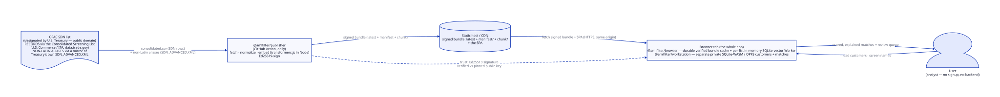
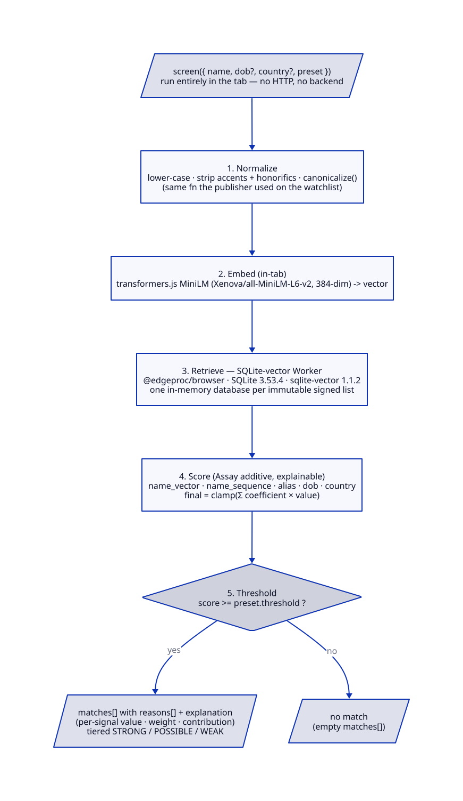

# Architecture

aml-filter screens a query name against the OFAC SDN sanctions list and returns a
**scored, explained** result. Every path follows the same shape: normalize the name
→ generate candidates by vector retrieval → score each candidate with a transparent
weighted policy → threshold → return matches with per-signal reasons.

## Built on edge-proc

aml-filter is two layers. The bottom layer is
[**edge-proc**](https://github.com/hseshadr/edge-proc) — a generic local-compute
substrate providing (a) **localvec**, an in-process FAISS vector index over a
sentence-transformers space, and (b) **bundles**, a signed, content-addressed
distribution format (Ed25519 + SHA-256, fail-closed). The top layer is **aml-filter**
— the OFAC domain model, the explainable weighted scorer, and the screening
pipeline. The substrate is reusable for any local search workload; aml-filter is what
turns it into sanctions screening.

That split yields **three screening paths**, one scoring contract:

- **Server, DB-backed** — `backend/aml_filter/api/` is a FastAPI app over
  PostgreSQL. `POST /v1/screen` is the front door; candidates come from **hybrid
  search** (pgvector + pg_trgm). Redis/Valkey backs rate limiting and the batch
  worker. This is the default HTTP path.
- **Server, bundle-backed (no Postgres)** — `backend/aml_filter/bundle/` syncs a
  signed edge-proc bundle and screens against its **localvec** index + in-memory
  entities. Gated on `BUNDLE_BASE_URL` + `VERIFY_KEY_PATH`; driven by the
  `amlfilter` CLI.
- **Browser, backend-free** — `frontend/packages/amlfilter-browser/`
  (`@amlfilter/browser`) syncs the same signed bundle into the tab and screens
  in-tab. No application backend in the request path.

The shared screening engine lives in
`backend/aml_filter/{search,scoring,embedding}/` (retrieval, the weighted scorer,
the local embedder).

## System context



A client POSTs a name to the API. The search service embeds and normalizes it,
asks PostgreSQL for candidates two ways (vector + lexical), scores them, and
returns matches. The sanctioned-entity data is loaded ahead of time from the
**official OFAC source** (the list is never bundled — see [`../NOTICE`](../NOTICE)).

## Screening pipeline



A `POST /v1/screen` request (`SearchQuery`: `name`, optional `dob`, `country`,
`entity_type`, plus `threshold` and `k`) flows through five stages:

1. **Normalize** — `aml_filter/domain/normalization.py` lower-cases the name,
   strips accents and honorifics, and canonicalizes it so spelling and
   diacritic noise don't break the match.
2. **Embed** — the normalized name is embedded by a local sentence-transformers
   model (`aml_filter/embedding/`), with an in-process cache.
3. **Candidate generation** — the retrieval backend depends on the path:
   - **DB path — hybrid search** (`aml_filter/search/hybrid_search.py`) takes the
     **union** of two retrievals: **vector** (`pgvector_backend.py`) — cosine
     similarity over name embeddings, catching transliterations and near-spellings;
     and **lexical** (`lexical_backend.py`) — `pg_trgm` trigram similarity, catching
     typos and partial names. Each candidate carries a `vector_score` and/or
     `lexical_score`.
   - **Bundle / browser path — localvec** (`aml_filter/search/localvec_backend.py`)
     runs the vector retrieval in-process against edge-proc's
     `FaissVectorIndex` (`IndexFlatIP` over the same sentence-transformers space) —
     a drop-in for the pgvector ANN with the same
     `vector_search(query_vector, k, tenant_id, filters)` contract. aml's list-IN
     and tenant-OR-global filters are preserved by carrying each entity's filter
     metadata on its `VectorEmbedding` and applying them in Python over an
     over-fetched candidate set. The lexical signal is derived in Python
     (`SequenceMatcher` trigram stand-in) so name scoring stays meaningful without
     Postgres.
4. **Score** — `aml_filter/scoring/policy.py` (`DefaultScoringPolicy`) turns
   each candidate into a final score plus a `MatchExplanation`.
5. **Threshold → decision** — candidates at or above the request `threshold`
   become `matches`; the rest are dropped.

The orchestration lives in `aml_filter/search/service.py` (`SearchService.search`),
which assembles the `SearchResponse` (`request_id`, `matches[]`,
`list_versions_used`, `execution_time_ms`).

## Scoring & explainability contract

The score is **not** a black box. `DefaultScoringPolicy.compute_score` sums
weighted signals, and emits each one as a `MatchSignal`:

```
final_score = Σ ( weight_i × value_i )      # clamped to [0, 1]
```

Signals: `name_vector`, `name_trigram`, `alias_match`, `dob_match`,
`country_match`. Weights come from a named **preset** — each preset is a
`ScoringWeights` + `threshold` pair:

| Preset | name_vector | name_trigram | alias | dob | country | threshold |
| --- | --- | --- | --- | --- | --- | --- |
| strict | 0.60 | 0.25 | 0.05 | 0.05 | 0.05 | 0.75 |
| balanced | 0.55 | 0.20 | 0.10 | 0.10 | 0.05 | 0.65 |
| lenient | 0.50 | 0.15 | 0.15 | 0.10 | 0.10 | 0.55 |

Every match in the API response carries:

- `reasons[]` — the weighted signals, each with `value`, `weight`, and
  `contribution` (`weight × value`).
- `explanation` — a plain-language summary (e.g. _"Match due to: strong vector
  similarity, country match"_).

This is the load-bearing contract: **a reviewer can always see why a score is
what it is.** If you change the signal set or the preset weights, the
explanation shape changes with it — keep the scorer and its tests in lockstep.
The same contract holds on all three paths — the bundle and browser tiers reuse
`DefaultScoringPolicy` (or its faithful TS port — identical weights, thresholds, and
signal order) unchanged, so an in-tab match carries the same per-signal reasons and the
same score as a server one.

## Signed-bundle distribution (the edge-proc bundle tier)

> A new diagram would help here — a `bundle-lifecycle.d2` showing
> `entities.jsonl + localvec vector/ + ofac_meta.json → build_bundle (chunk + sign)
> → origin → sync_index (verify) → SyncedBundle`. Not yet rendered; described below.

The OFAC list is distributed exactly like edge-reco's catalog: a signed,
content-addressed bundle. The **producer** and **consumer** are thin domain wrappers
over edge-proc's generic `build_bundle` / `sync_index`.

**Producer** (`aml_filter/bundle/publish.py`, behind `amlfilter bundle`):

1. `build_staging_dir` lays out three files in a staging dir — `entities.jsonl`
   (one JSON domain `Entity` per line: id, names, aliases, countries, dob, type,
   risk, list), a prebuilt localvec `vector/` index (built from the embedded names,
   persisted verbatim for zero recompute downstream), and `ofac_meta.json`
   (`OfacBundleMeta`: `list_id`, `version`, counts, embedding model/dim).
2. `publish_bundle` reads every staging file into `{relpath: bytes}` and hands them
   to edge-proc's `build_bundle` with a `GearCDC` chunker and an `Ed25519Signer`,
   which chunks + signs + lays out the **flat origin** a device can sync: a `latest`
   version pointer (Ed25519-signed) → an immutable `manifest/<hash>` → immutable
   `chunk/<hash>` objects.

edge-proc stays generic (opaque files only); this module owns the domain shape.

**Version pointer.** `ofac_meta.json`'s `list_id` + `version` mirror the OFAC
`ListVersion` (the ACTIVE, version-stamped list), so the consumer can report
`list_versions_used` in its `SearchResponse` without ever touching Postgres.

**Consumer** (`aml_filter/bundle/sync.py`, behind `amlfilter sync` / `screen` and
the server's bundle read-path):

1. `sync_bundle` calls edge-proc's `sync_index` with an `Ed25519Verifier` over the
   pinned public key. Verification is **fail-closed** — any signature or SHA-256
   mismatch aborts the load; there is no silent fallback to an empty index.
2. It reads the active version pointer + manifest, `materialize_file`s each entry
   into a local dir, and loads `ofac_meta.json`, the entities, and the localvec
   index into a `SyncedBundle` (entities also indexed by id for O(1) scoring
   lookup). The result is screenable **without Postgres**.

**Server bundle read-path.** `aml_filter/bundle/runtime.py` gates on
`Settings.bundle_mode_active()` (both `BUNDLE_BASE_URL` and `VERIFY_KEY_PATH` set).
When active, screening sources OFAC candidates from the synced bundle via
`BundleScreeningSource` instead of `SearchService`; otherwise the DB path is
untouched.

## Browser tier (`@amlfilter/browser`)

The same pipeline runs **in the tab** via the
`frontend/packages/amlfilter-browser` workspace package, mirroring edge-reco's
Nimbus demo:

- `@amlfilter/browser/engine` is a **verbatim port of edge-proc's browser sync
  tier** — domain-agnostic: it syncs a signed, content-addressed bundle into OPFS
  (Origin Private File System), verifies it Ed25519 + SHA-256 **fail-closed**, and
  reassembles files, all in a Web Worker. Same wire format, same trust root as the
  Python producer.
- The package root layers OFAC screening on top: a TS port of the domain model, the
  normalizer, a localvec-equivalent `vectorIndex`, and the **same explainable
  scoring contract** (the `PRESETS` weights and `computeScore` are a faithful port of
  `DefaultScoringPolicy`), so an in-browser match reproduces the server's score and reasons.
- `EngineRuntime.bootstrap()` drives the boot stages (syncing → synced →
  reassembling → loading the MiniLM embedder → ready); the `/screen` page
  (`frontend/app/src/pages/ScreenPage.tsx`) wires this to a live search box that
  ranks the list as you type (and browses it when empty), rendering each match's
  score, plain-language explanation, and per-signal breakdown. The
  public key is pinned in the app build and served from the app's **own** origin,
  never from the (untrusted) bundle origin.
- What's cross-language **parity-tested**: the signed-bundle wire format (`crypto.test.ts`
  checks the TS reader against a real Python-signed fixture and fail-closes on tamper), the
  normalizer (`normalize.test.ts`), and the **scorer's full output** — score, reasons, and
  each reason's plain-language description (`scoring.parity.test.ts` asserts the TS scorer
  against a golden emitted by the Python source of truth via
  `backend/scripts/gen_scoring_golden.py`). The MiniLM embedder is wired through a stubbable
  `createEmbedderWith` seam for parity testing but has no committed parity test yet.

## Data model (high level)

Stored in PostgreSQL (`aml_filter/db/models.py`), populated by ingestion:

- **Entity** — a sanctioned person or organization: `entity_id`, `primary_name`,
  `entity_type`, `risk_category` (SANCTION / PEP / CUSTOM / WHITELIST),
  `source_list`, `list_version`, plus `countries[]` and `dob[]`.
- **Alias** — alternate names for an entity (with canonical forms), used by the
  `alias_match` signal.
- **Name embedding** — the pgvector vector per name, built at ingest time by the
  same local embedder used at query time (so query and corpus live in the same
  space).
- **SearchRequest** — an audit row per screening call.

The query/response shapes (`SearchQuery`, `Match`, `MatchReason`,
`MatchSignal`, `MatchExplanation`, `SearchResponse`) are Pydantic models in
`aml_filter/domain/search.py` — the typed contract at the API boundary.

## Ingestion (loading the OFAC list)

aml-filter does not ship the SDN list. The operator downloads it from the
official OFAC source and ingests it:

- `aml_filter/ingest/parsers/ofac.py` parses the OFAC SDN XML.
- `aml_filter/ingest/service.py` (`IngestionService.ingest_ofac_sdn`) upserts
  entities + aliases, builds embeddings, and stamps a `list_version`.
- `scripts/ingest_ofac.py <sdn.xml> [list_id] [version]` is the CLI wrapper.

See [`QUICKSTART.md`](QUICKSTART.md) for the end-to-end load and
[`../NOTICE`](../NOTICE) for the source and public-domain status of the list.

## Where config lives

All runtime configuration is env-driven through Pydantic `BaseSettings` in
`aml_filter/config.py` — no hardcoded knobs:

- `DATABASE_URL` — async Postgres DSN. Required for the DB path; that path fails
  closed without it. The bundle path does **not** require it.
- `REDIS_URL` — Redis/Valkey for rate limiting + the worker queue.
- `SCREENING_QUEUE_NAME` — RQ queue name for batch jobs.
- `VECTOR_INDEX_DIR` — where the edge-proc localvec FAISS index is persisted
  (default `.vector_index`). Resolved standalone, so building/loading the vector
  backend never forces a `DATABASE_URL`.
- `BUNDLE_BASE_URL` + `VERIFY_KEY_PATH` — set **both** to activate the bundle-backed
  read-path (`Settings.bundle_mode_active()`). `BUNDLE_CACHE_DIR` (default
  `.ofac_bundle`) is the local sync cache.

Copy `.env.example` → `.env` to set them. See [`DEPLOY.md`](DEPLOY.md) for the
deployment surface.

## Invariants (load-bearing rules)

- **Explainability is non-negotiable.** Every match carries its signal
  breakdown. Don't add a scoring path that returns a bare number.
- **The list is never bundled.** It's downloaded from OFAC at runtime. Keep it
  out of the repo and out of any container image.
- **Same embedder, query and corpus.** Query names and stored names must be
  embedded by the same model, or vector similarity is meaningless. This holds
  across runtimes too — the browser runs the same MiniLM model as the Python
  encoder (via transformers.js), which is what makes browser/server parity possible.
- **Fail closed on config and on trust.** Missing `DATABASE_URL` aborts the DB path;
  bundle mode requires both `BUNDLE_BASE_URL` and `VERIFY_KEY_PATH` (no silent
  fallback to an empty index); and any Ed25519/SHA-256 mismatch aborts a bundle sync.
- **One scoring contract, three paths.** DB, server-bundle, and browser screening
  all emit the same `reasons[]` + `explanation`. A new path that returns a bare
  number is a contract violation.

## Further reading

- [`QUICKSTART.md`](QUICKSTART.md) — clone → gate → load a list → screen a name.
- [`DEPLOY.md`](DEPLOY.md) — docker-compose, env vars, refreshing the OFAC list.
- [`diagrams/`](diagrams/) — d2 sources (`system-context.d2`, `screening-pipeline.d2`) + rendered SVGs.
- [`../NOTICE`](../NOTICE) — OFAC attribution and the not-a-compliance-product disclaimer.
